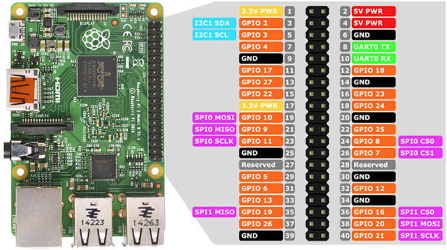

# Audio Cabina

## Hardware necessario
Ovviamente serve il telefono di Swisscom, ma oltre a quello servono i seguenti componenti, qui si fa riferimento a Distrelec come fornitore.

* 1 [Raspberry PI 3 Model B+](https://www.distrelec.ch/en/raspberry-pi-model-1gb-ram-raspberry-pi-raspberry-pi-3b/p/30109158?mainId=30037321)
* 10 [Jumper Wires, Male to Female](https://www.distrelec.ch/en/jumper-wire-male-to-female-pack-of-10-pieces-150-mm-multicoloured-rnd-components-rnd-255-00013/p/30115111)
* 1 [Mono Jack Connector 3.5mm](https://www.distrelec.ch/en/mono-jack-connector-black-mm-male-rnd-connect-rnd-205-00618/p/30090513)
* 1 [Modular Jack](https://www.distrelec.ch/en/modular-jack-bel-stewart-ss-6444-nf/p/14269430)
* 1 [alimentatore Micro-USB da 2.5/3A](https://www.distrelec.ch/en/usb-power-supply-for-raspberry-pi-5vdc-5a-raspberry-pi-t5989dv/p/30134465) o un power bank USB
* 1 [MicroSD](https://www.distrelec.ch/en/microsdhc-card-16gb-uhs-kingston-shop-sdcs-16gbsp/p/30117493)
* 1 [chiavetta USB](https://www.distrelec.ch/en/usb-stick-datatraveler-106-16gb-usb-gen-usb-kingston-shop-dt106-16gb/p/30146164) per i file audio
* 1 [Case](https://www.distrelec.ch/en/plastic-housing-black-raspberry-pi-rpi-case-blk-rb-case-04b/p/30037321)

## Installazione
### Audio files
Nella chiavetta USB vanno create due directory:
* *Audio*: qui andranno i vari file audio in formato MP3, il nome del file deve essere un numero e l'estensione *'.mp3'*, quindi saranno accettati file come 3.mp3, 004.mp3, 090.mp3, 1123455442123.mp3, etc.
* *NOT_FOUND*: qui andranno dei file MP3 che saranno eseguiti nel caso di 'file audio non trovato'.

### Sistema Operativo
Partire con una installazione di [Raspbian](https://www.raspberrypi.org/downloads/raspbian/) in versione Lite (dettagli per l'installazione [qui](https://www.raspberrypi.org/documentation/installation/installing-images/README.md)).

### Configurare WiFi
Al primo boot è più facile connetterla ad un monitor e tastiera. Se non li avete potete configurare il WiFi direttamente dalla SD, create un file *wpa_supplicant.conf*
```
country=CH # Your 2-digit country code
ctrl_interface=DIR=/var/run/wpa_supplicant GROUP=netdev
network={
    ssid="YOUR_NETWORK_NAME"
    psk="YOUR_PASSWORD"
    key_mgmt=WPA-PSK
}
```
e poi create un altro file (vuoto) chiamato *ssh*, questo abiliterà il servizio SSH sin dal primo avvio.
Inserite la SD nel RaspberryPI e dategli la corretta alimentazione.

### Setup software e dipendenze
Da una shell di Raspbian eseguite i seguenti comandi:
* aggiornare il sistema operativo
```
sudo apt-get update && sudo apt-get -y upgrade && sudo apt -y autoremove
```
* installare pacchetti aggiuntivi
```
sudo apt-get install -y vim usbmount git espeak jack python3-pip python3-pygame
pip3 install pad4pi
```

* mettere la chiavetta USB in auto mount al boot
editare il file */lib/systemd/system/systemd-udevd.service* e cambiare "PrivateMounts=yes" in "PrivateMounts=no"
```
ln -s /media/usb0 /home/pi/audio
sudo reboot
```

* clonare il progetto
```
git clone https://github.com/ated4kids/audio-phone-booth.git
chmod +x audio-phone-booth/launcher.sh
```

* avviare in automatico lo script al boot
aggiungere in cron al reboot l'esecuzione dello script
```
crontab -e
@reboot sleep 10 /home/pi/audio-phone-booth/launcher.sh >> /home/pi/script.log 2>&1 &
```

* spengere il Raspberry e riaccenderlo collegato al telefono (procedere prima con i passi seguenti)
```
sudo halt
```

## Preparazione telefono


### Rimozione componenti non necessari
Rimuovere tutte le schede e cablaggi non necessari


Tenere solo il cavo che esce dalla tastiera (1), quello del display (2) e quello della cornetta (3)


### Mappatura cavi e pin 
Guardando le due seguenti foto si nota la numerazione che viene data ai PIN del cavo della tastiera e del RaspberryPI (porte GPIO)
<p align="center"></p>
<p align="center"></p>

Quindi, seguendo lo schema successivo vediamo come andremo a collegare le due parti


La tabella sopra rappresenta la matrice per i tasti del telefono

